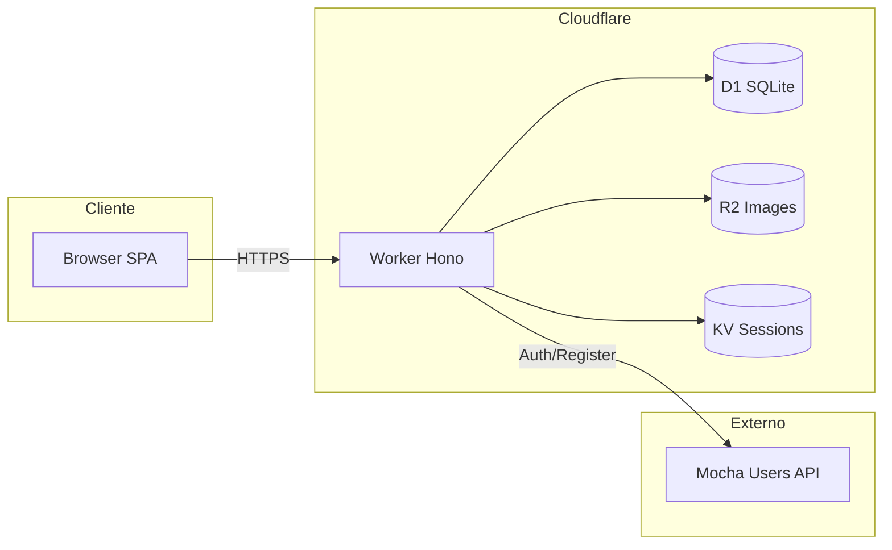

# Arquitectura

## Visión general

El sistema es una SPA (Single Page Application) servida y ejecutada en Cloudflare Workers. El frontend (React) y el backend (Hono) se despliegan juntos: el Worker sirve los assets estáticos y atiende la API.

## Diagrama

## Flujo de una petición

1. **Browser** hace una petición (navegación o fetch) al Worker.
2. **Worker (Hono)**:
   - Si es una ruta de API (`/api/*` o `/health`), la maneja el router de Hono.
   - Si no, devuelve el SPA (single-page-application): `index.html` y el frontend enrutado en cliente.
3. **Datos:** Las APIs leen/escriben en **D1** (SQLite), **R2** (imágenes) y **KV** (sesiones).
4. **Auth:** Login y registro se delegan a **Mocha Users API**; las sesiones se guardan en **KV** y se envían por cookie al cliente.

## SPA y rutas frontend

- **Públicas:** `/`, `/login`, `/register`, `/:slug` (página de reserva por slug del negocio).
- **Protegidas (dashboard):** `/dashboard`, `/dashboard/services`, `/dashboard/schedules`, `/dashboard/appointments`, `/dashboard/settings`. Las páginas Customize, Payments y Social existen pero no están enlazadas en el menú del layout.

El frontend usa React Router; el Worker tiene `not_found_handling: "single-page-application"` para devolver el mismo `index.html` en rutas no-API.

## Autenticación

- **Registro/Login:** Se llama a la API de Mocha; si es correcto, se crea una sesión en KV con TTL y se envía una cookie `session_token` al cliente.
- **Rutas protegidas:** El middleware `authMiddleware` lee la cookie, busca la sesión en KV y expone `c.set("user", { id, email })`. Si no hay sesión válida, responde 401.
- **Multi-tenant:** Cada recurso de negocio (tenant, servicios, citas, etc.) está asociado a un `tenant_id`. Las APIs del dashboard solo permiten acceso a recursos cuyo `tenant_id` corresponda a los tenants del usuario autenticado.

## Multi-tenant por slug

- Cada negocio (tenant) tiene un `slug` único (ej. `mi-peluqueria`).
- La URL pública de reservas es `/:slug` (ej. `https://citame.click/mi-peluqueria`).
- La API pública usa el slug para identificar el tenant: `GET /api/public/tenants/:slug`, `GET /api/public/tenants/:slug/services`, etc. No requiere autenticación.

## Stack resumido

| Capa        | Tecnología                          |
|------------|--------------------------------------|
| Runtime    | Cloudflare Workers                   |
| API        | Hono                                 |
| Frontend   | React 19, Vite 7, React Router 7     |
| Base de datos | D1 (SQLite)                       |
| Storage    | R2 (imágenes), KV (sesiones)        |
| Auth       | @getmocha/users-service + sesiones KV |
