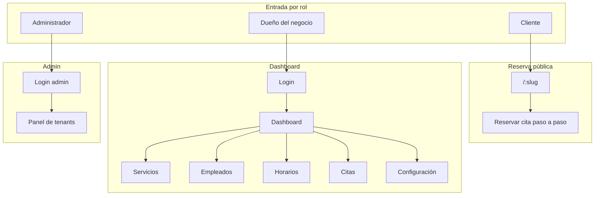
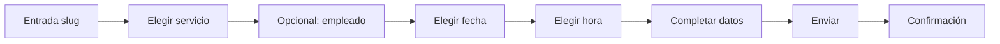
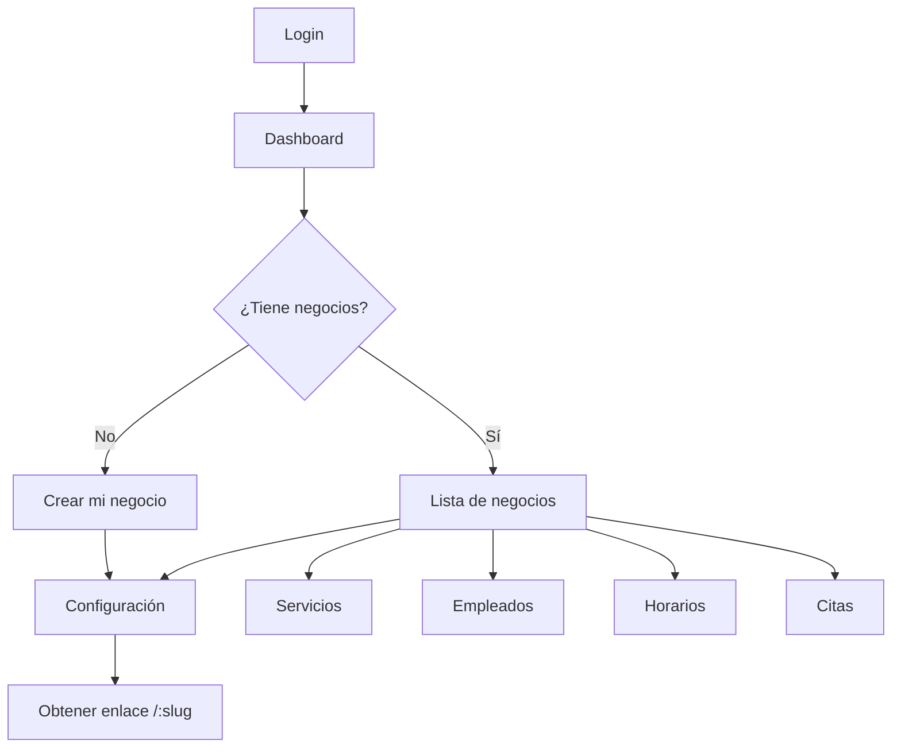
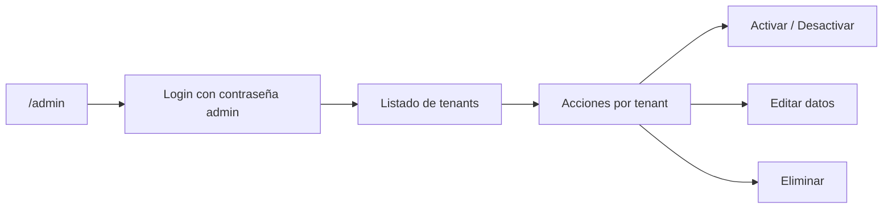

# Flujos de usuario

Documentación de los flujos lógicos del sistema para que cualquier persona entienda cada proceso paso a paso.

## Visión general por rol

El sistema tiene tres tipos de usuario. Cada uno entra por una ruta distinta y sigue un flujo propio.



| Rol | Entrada | Objetivo |
|-----|---------|----------|
| **Cliente** | `https://citame.click/mi-negocio` (slug del negocio) | Reservar una cita sin cuenta |
| **Dueño** | Login → `/dashboard` | Gestionar negocios, servicios, empleados, horarios y citas |
| **Admin** | `/admin` → Login → `/admin/dashboard` | Gestionar negocios (activar/desactivar, etc.) |

---

## Flujo de reserva pública (cliente)

El cliente llega al enlace del negocio (`/:slug`) y sigue una secuencia de pasos hasta confirmar la cita.



### Pasos detallados

1. **Entrada** – El usuario abre el enlace del negocio (ej. `citame.click/mi-peluqueria`). Ve la tarjeta del negocio, datos de contacto y la lista de servicios.
2. **Elegir servicio** – Clic en un servicio. Si tiene variantes (ej. Corte mujer / hombre), elige una en el modal. Luego confirma y pasa al siguiente paso.
3. **Elegir empleado (opcional)** – Si el negocio tiene empleados para ese servicio, aparece la pregunta "¿Con qué empleado?". Puede elegir **Cualquiera** (ver disponibilidad de todos) o un nombre concreto (ej. su barbero o dentista favorito).
4. **Elegir fecha** – Se muestran solo los días con disponibilidad. El usuario elige uno.
5. **Elegir hora** – Se muestran los horarios disponibles de ese día. El usuario elige uno.
6. **Completar datos** – Nombre, teléfono/WhatsApp y opcionalmente email y notas. Envía el formulario.
7. **Confirmación** – Mensaje de éxito y, si está configurado, enlace a WhatsApp para confirmar.

**Nota:** "Cualquiera" en empleado significa que se muestran fechas y horarios en los que **cualquier** empleado asignado al servicio tiene hueco.

---

## Flujo del dashboard (dueño)

El dueño inicia sesión y accede al panel para gestionar uno o varios negocios.



### Primera vez (recomendado)

Para empezar a recibir reservas, el orden sugerido es:

1. **Crear negocio** – En Dashboard, "Crear mi negocio" (o en Configuración, "Nuevo negocio"). Completar nombre, slug, contacto, etc.
2. **Añadir servicios** – Ir a Servicios y crear al menos un servicio (nombre, duración, precio; opcionalmente variantes).
3. **Opcional: empleados** – En Empleados, añadir personas y asignarles servicios. Si no hay empleados, las citas no llevan asignación.
4. **Definir horarios** – En Horarios, indicar qué días y franjas está disponible el negocio (o cada empleado si se usa).
5. **Compartir enlace** – El enlace de reservas es `https://citame.click/TU-SLUG`. Compartirlo con los clientes.

La navegación lateral del dashboard permite saltar a cualquier sección en cualquier momento.

---

## Flujo admin

El administrador gestiona los negocios (tenants) desde un panel separado.



- **Entrada:** `https://citame.click/admin` (o `admin.citame.click`).
- **Login:** Contraseña de administración (configurada en Cloudflare).
- **Dashboard:** Lista de negocios con email, WhatsApp, dominio/slug y acciones (activar/desactivar, cambiar contraseña, eliminar, etc.).

---

## Flujo de autenticación (login / registro)

```mermaid
flowchart TB
  Home[Home /] --> Elegir{¿Qué hace?}
  Elegir -->|Entrar| Login[Login]
  Elegir -->|Registrarse| Register[Registro]
  Login --> Mocha[Mocha Users API]
  Register --> Mocha
  Mocha --> OK{¿Correcto?}
  OK -->|Sí| Cookie[Sesión en cookie]
  OK -->|No| Error[Error / reintentar]
  Cookie --> Redirect[Redirección]
  Redirect --> Dashboard[/dashboard]
```

- **Login y registro** se delegan a la API de Mocha. Si son correctos, se crea una sesión en KV y se envía una cookie al navegador.
- Las rutas bajo `/dashboard` requieren sesión; si no hay, se redirige a `/login`.
- Tras iniciar sesión, el usuario suele ir a `/dashboard` para gestionar sus negocios.
